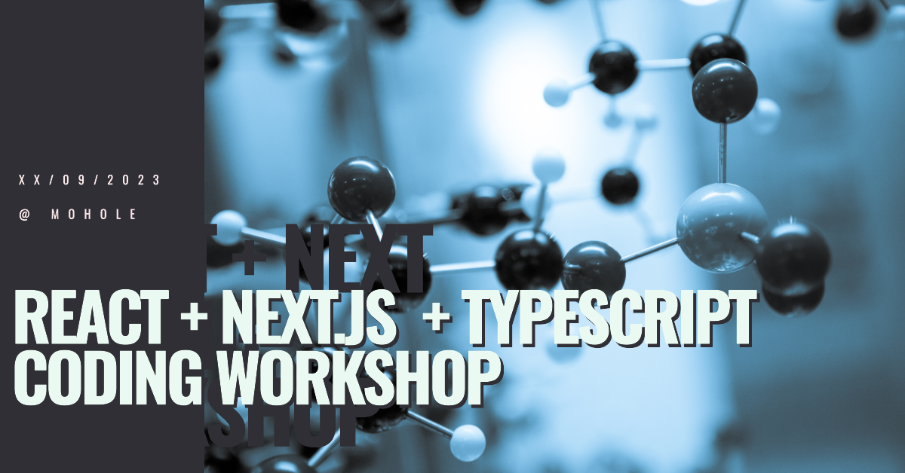

# React + Next.js Workshop - 14/09/2023 @ Mohole


<small>_image generated with Microsoft Designer_</small>

`[ITA]`
In questo workshop della durata di un giorno combineremo React, Next.js, Typescript e Tailwind per creare una semplice app di chat da zero. Ci appoggeremo a Supabase per la parte di autenticazione e persistenza dei dati per poi pubblicare il nostro progetto su Vercel.

`[EN]`
In this one-day workshop we will combine React, Next.js, Typescript and Tailwind to create a simple chat app from scratch. Authentication and data persistance will be handled by Supabase and then we will publish our project on Vercel.

## Requirements

- [Node.js](https://nodejs.org/) v16+
- [VS Code](https://code.visualstudio.com/)
- [React developer tools](https://chrome.google.com/webstore/detail/react-developer-tools/fmkadmapgofadopljbjfkapdkoienihi) (_browser extension_)
- [Vercel](https://vercel.com/) free account
- [Supabase](https://supabase.com/) free account

## What we are using

- [React v18](https://react.dev/) - reactive UI library
- [Next.js v13](https://nextjs.org/) - web framework for React
- [Typescript](https://www.typescriptlang.org/) - JavaScript with syntax for types
- [TailwindCSS](https://tailwindcss.com/) - CSS as utility classes
- [DaisyUI](https://daisyui.com/) - UI components built on top of TailwindCSS
- [date-fns](https://date-fns.org/) - JS utility for date formatting
- [Supabase](https://supabase.com/) - open source Firebase alternative (*we are using it for the **Database** and **Authentication** features*)

## Table of Contents

- icebreaking
- intro + high level concepts
- setup the project locally
- configuring Supabase
- breaking up the UI into components
- implement basic authentication
- _-- lunch break --_
- reading & writing messages
- manage channels
- publish the project
- Q&A
- closing

## Publishing

This project can be deployed on any Node.js hosting, but to keep things simple & easy we will use the [Vercel free tier](https://vercel.com/pricing).

Since we are using Supabase, there is no need to take any action for the backend & database. However, **it is very important to not commit the Supabase anon key** in the repository but using `.env` files and the environment settings in Vercel.

## Getting started

Clone the repo

```bash
$ git clone https://github.com/mohole/next-workshop
```

change to project folder

```bash
$ cd next-workshop
```

install the dependencies

```bash
$ npm ci
```

start the local development server

```bash
$ npm run dev
```

you can now check your application at `http://localhost:3000`.

## Where to go from here

Feel free to enhance and add features to this project since it's just a sample to give you a glimpse on how to combine these tools to create a simple product:

- design a better UI (_with or without Tailwind_)
- add a page to manage (_add, edit, remove_) the channels
- handling exceptions (_messages list didn't load, user trying to access a deleted channel, etc..._)
- add roles to users (_example: normal users can just chat, admins can manage the channels_)
- use fine-grained RLS policies to not show messages to anonymouse users
- add a button/gesture to edit e message
- add "reply to message" functionality

or ultimately...

- re-use the code of this project with a **completely different service or data source** ([https://github.com/public-api-lists/public-api-lists](https://github.com/public-api-lists/public-api-lists))

## License
Code released under the [MIT License](LICENSE).

All of the uncredited images have been generated with [Midjourney](https://www.midjourney.com/).
