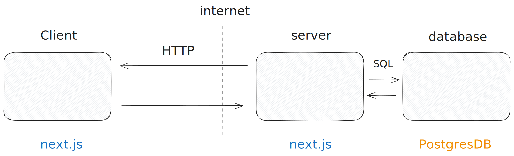

## 02. Building a REST API

So far we have only seen how to retrieve data from a REST endpoint, but we are not limited to that.

Our REST API will be mapped 1:1 to the previous database queries, except the one we used to create the database.

| REST route       | HTTP action | SQL query type   |
| ---------------- | ----------- | ---------------- |
| `/api/todo`      | `GET`       | `SELECT...`      |
| `/api/todo`      | `POST`      | `INSERT INTO...` |
| `/api/todo/[id]` | `DELETE`    | `DELETE FROM...` |
| `/api/todo/[id]` | `PUT`       | `UPDATE...`      |

---

### Docs

[https://nextjs.org/docs/app/building-your-application/routing/route-handlers](https://nextjs.org/docs/app/building-your-application/routing/route-handlers)
