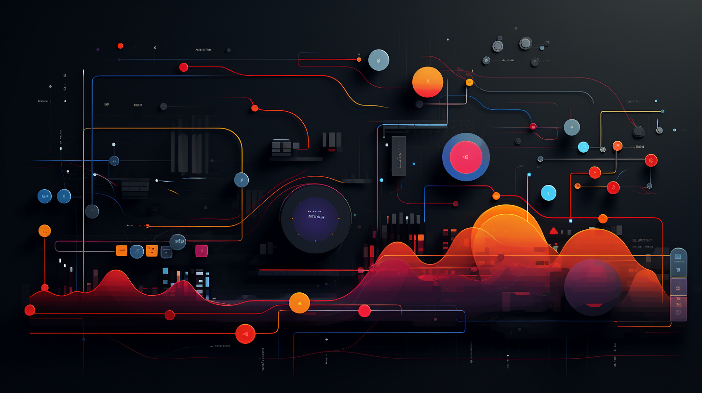
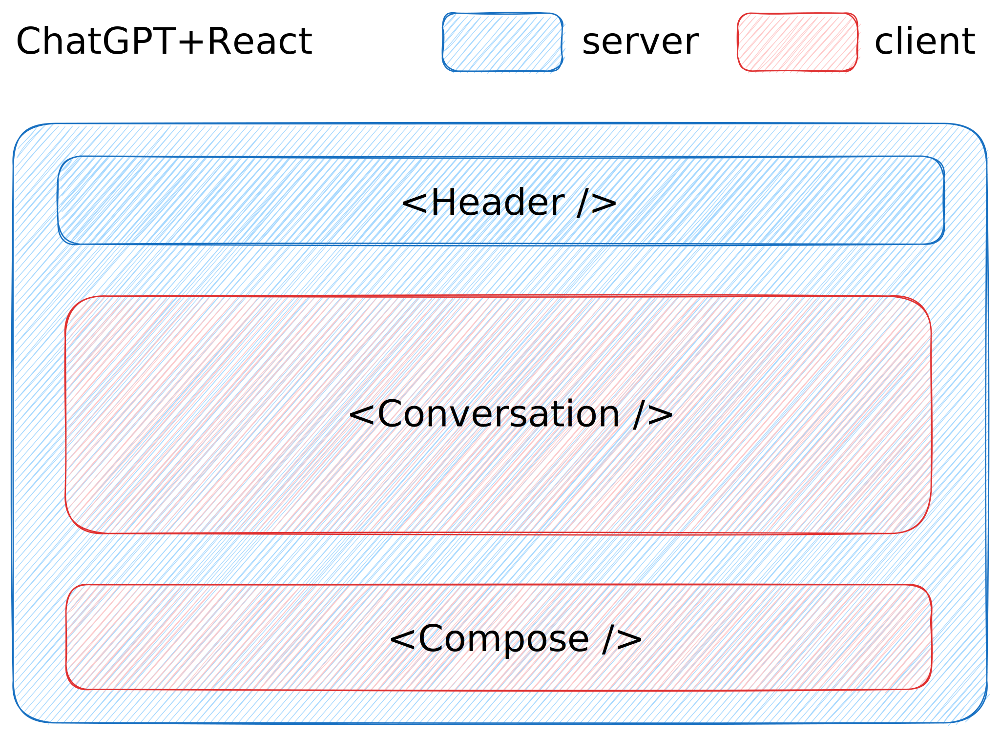

# User Interface

### Routes

- `/` will just redirect to first channel available
- `/channel/{uuid}` the main application, the `uuid` will tell us which channel data to load

### Server vs Client components

| Feature/Type | Server component | Client component |
|---|---|---|
| code execution | server only (🤯) | server **and** client |
| send JS to client | ❌ | ✅ |
| interactions | ❌ | ✅ |
| hooks | ❌ | ✅ |

### How the main UI will be organized

- the page component itself is a Server Component
- `<Header />` is a Server component with a Client component as child
- `<Conversation />` and `<Compose />` will be Client components since are the part that requires interactivity
- the page component will load the messages data and pass it to the `<Conversation />` component so that the first load will be faster, but from then on `<Conversation />` will update and re-load the data

