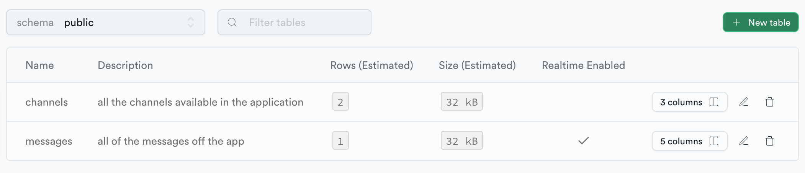

# Development steps

Let's create groups of 2-3 people each:
- so you cant interact with each other data 
- just 1 of each group will need to setup Supbase and Github app, the others will just read from it


1. Create a new OAuth app on Github
    - https://github.com/settings/developers
    - https://supabase.com/docs/guides/auth/social-login/auth-github
2. Create a new project on Supabase
    - https://supabase.com/dashboard/project/
3. on `Authentication > Providers` **disable Email** and **enable Github** and fill the data between this screen and the step 1, also set the redirects urls in `Authentication > URL Configuration`
    - `http://localhost:3000`
    - `https://*.vercel.app`
4. on `Database > Tables` lets create 2 new tables
    - the `channels` table
      - `id` as `uuid` and self generated value
      - `created_at` as `timestamptz`, default value `now()`and enable `nullable` 
      - `name` as `text`
      - doesn't need realtime updates
      - as RLS policicy use the *"Enable read access for all users"* template
    - the `messages` table
      - **enable** realtime updates
      - as RLS policicy use the *"Enable read access for all users"* and *"Enable insert for authenticated users only"* templates



5. create a new Next.js app
    - `npx create-next-app@latest`
    - enable Typescript
    - use the `/app` folder version
6. install and configure Daiys UI and the Supabase JS DSK
    - https://daisyui.com/docs/install/
    - https://supabase.com/docs/reference/javascript/initializing
7. create an `.env.local` file on root folder with the following content

```
NEXT_PUBLIC_SUPABASE_URL=[your value here]
NEXT_PUBLIC_SUPABASE_ANON_KEY=[your value here]
```
8. create `/` and `/channel/[id]` components first and load the `channel` data to implement the redirect
9. add the `<Header />` and `<Conversation />` component and load the `messages` data
10. implement the sign in and sign out functionlity
11. in the `<Compose />` component implement the post message logic
12. add the realtime updates in `<Conversation />` component
13. add the `<Select />` to switch between channels
14. create a project on Vercel and publish the code
    - add the environment variables (copy the values from the `.env.local` file)
    - run the publish command or connect the project to a Github repo 